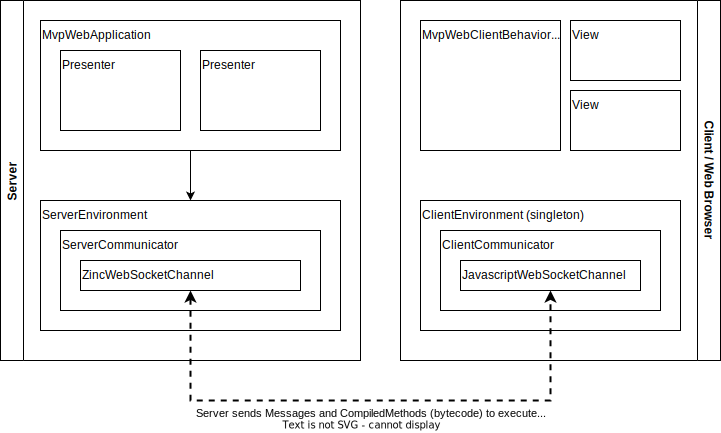

# Implementation

Some implementation information is described below. If you need some more info, please let me know by creating an issue on GitHub.

The CodeParadise framework enables remote Smalltalk code execution in a JavaScript environment. This means you can run Smalltalk inside the web browser or inside a Node.js application and not be concerned with any JavaScript. A regular (but tiny) Smalltalk image runs on [CodeParadise VM](https://github.com/ErikOnBike/SqueakJS) and replaces the use of JavaScript. This tiny image runs the same bytecode as a regular Pharo/Squeak/Cuis image, so no transpilation is taking place. JavaScript callbacks and Promises are supported by using Smalltalk Blocks and 'proxied' objects. For web applications a VM plugin is present with Classes which wrap the browser DOM functionality. All DOM manipulation is done through Smalltalk code. Did I mention, no more use of JavaScript ;-).

CodeParadise allows you to create web applications without having to resort to JavaScript. Since the browser can normally only run JavaScript, JavaScript is needed to bootstrap a Smalltalk VM and its plugins. The VM is based on [SqueakJS VM](https://squeak.js.org). Apart from that, no JavaScript should be necessary. If needed, existing JavaScript libraries can be used with CodeParadise. These have to be wrapped in a VM plugin or use a generic approach of sending messages. This later is only possible when the JavaScript library has a simple interface to which regular Smalltalk objects can be mapped. Have some explicit needs? Please contact me.

Web applications can be built using CodeParadise in a number of flavors:

* Bare metal (see `CpServerApplication`) - you will have to create any interaction with the browser yourself
* Plain vanilla (see `CpWebApplication`) - you will receive DOM functionality to interact with
* Full monthy (see `CpMvpWebApplication`) - you will receive Model View Presenter functionality

The MvpWebApplication has the most features and is explained here. You might want to check out the information about CodeParadise's [Model View Presenter](./MVP.md) pattern to understand its design.

The MvpWebApplication is the server side application. An instance of `CpMvpWebApplication` represents an application session with a client (the web browser). The MvpWebApplication keeps track of its Presenters. This means a full session state is kept on the server. A user performing a reload in the browser will get back into exactly the same state as before the reload (assuming you're not going to update things in the browser you didn't tell your server about ;-). For every Presenter a View is created in the browser. Views are [WebComponents](https://developer.mozilla.org/en-US/docs/Web/Web_Components) that are added dynamically to the HTML document in the browser.

Adding a Presenter to the MvpWebApplication (or as child of an existing Presenter) will create the required View in the client. For convenience different render methods are available on the Presenter which will make sure any child Presenters and/or Views are updated according to the current model. This allows developers to focus on setting up the correct model and prevents from having to keep track of all required updates to the visual objects.

## Design details

As can be seen in the image below, the MvpWebApplication has a ServerEnvironment to which it is connected. The ServerEnvironment communicates with a ClientEnvironment in the browser. Currently WebSockets are used as a communication channel. This allows communication in both directions. The ServerEnvironment and ClientEnvironment are needed for all three types of web applications. So if you want to go bare metal, you still need these to setup an application.

The reason the MvpWebApplication is shown 'connected' to the ServerEnvironment instead of encompassing it, is deliberate. In CodeParadise a `CpApplicationServer` exists. It is a HTTP server which creates ServerEnvironments. Whenever a new connection is made to the server a new ServerEnvironment is created. The ApplicationServer will also announce this fact and any registered applications can connect an application instance to the newly created environment.

From the client side a ClientEnvironment is created at startup. The tiny Smalltalk image which is created in the browser does this. The ClientEnvironment once created, makes a connection to the server and provides (if available from the browser's [sessionStorage](https://developer.mozilla.org/en-US/docs/Web/API/Window/sessionStorage)) its existing session id. When a connection is made, the web application starts installing relevant classes (including methods) in the client. The WebApplication and MvpWebApplication flavors do install a number of base classes to get things going. When going bare metal, you'll have to do this yourself. A list of pre-installed Classes can be found by executing `CpClientEnvironment preInstalledClasses`.

Installing a Class inside the client (when using the MvpWebApplication flavor, most is installed automagically) will install all its methods as well. If a method refers to another Class, this Class will also be installed. This means that if your View class refers to `OpalCompiler` it will try to install the Pharo Smalltalk compiler in the client. This will fail, because the tiny Smalltalk image is only equiped with a limited set of classes and methods. Views are supposed to be thin and lean. It is not designed to have a copy of your business objects in the browser. Support is present to allow the specification of packages/classes/methods from which code can or can't be installed. This allows the presence of development code and/or developer code (i.e. running in the Pharo IDE) to be present on classes which get (now partially) installed in the browser.

A View in the browser can only communicate back to the server by announcing something. This is a deliberate design decision. For starters, the model stays clean this way. Secondly it is a more safe/secure approach. IF any wrong-doer would be able to create his own Announcements it would not do harm on the server. Please, do not allow the server to #perform: anything directly received from the client. Always validate the received information on the server. Having meaningful Announcements with simple data is probably the best way to go. It does not hurt performance to create an Announcement per state for example and prevent having to add state as a value added onto a more generic Announcement. It is also nicer to listen to a number of explicit Announcements on the server, instead of having to decide what to do based on a value from a single Announcement.

The ClientEnvironment for running in the browser can be installed manually. To download the ClientEnvironment clone [CP-ClientEnvironment](https://github.com/ErikOnBike/CP-ClientEnvironment) or copy the 3 raw files in the html directory (you can ignore the 'resources' directory). Remember the directory in which the 3 files `app.html`, `webapp_bundle.min.js` and `client-environment.image` are written. You will need this location when starting the ApplicationServer.

The files:

* `app.html` contains a few lines of code to start the Squeak JS VM and specify which Smalltalk image to run
* `webapp_bundle.min.js` contains the Squeak JS VM in headless mode (ie no BitBlt support) and a number of plugins
  * Large Integers
  * (CodeParadise) System (includes WebSocket support)
  * (CodeParadise) DOM (wrapper code for DOM functionality)
* `client-environment.image` is a tiny (around 225Kb) Smalltalk image

The ApplicationServer provides an HTTP server (using [Zinc HTTP Components](https://github.com/svenvc/zinc)) for a number of static files. You can use any other web server for this if you prefer.

The ApplicationServer also provides a WebSocket server (again using [Zinc HTTP Components](https://github.com/svenvc/zinc)) for the interactive communication between ClientEnvironment and ServerEnvironment.

The tiny Smalltalk image does not include a Compiler or Debugger. If you try to start it using a desktop VM you will not get it running, since it assumes a number of JavaScript primitives is implemented. The image is based on [Pharo Candle](https://github.com/carolahp/PharoCandleSrc) but has been extended and upgraded to be more compatible with Pharo v10 (instead of v8) and includes the ClientEnvironment code to get things started. The code and some explanation for this tiny image can be found on [CP-Bootstrap](https://github.com/ErikOnBike/CP-Bootstrap). The tool to create the tiny image can be found on [TinyBootstrap](https://github.com/ErikOnBike/TinyBootstrap).

